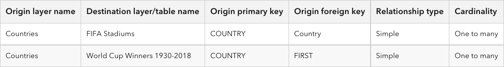

# FIFA World Cup Relationship Explorer
This application uses the ArcGIS API for JavaScript to display FIFA World Cup data from 1930-2018. [RelationshipContent](https://developers.arcgis.com/javascript/latest/api-reference/esri-popup-content-RelationshipContent.html)(version 4.25) is added to the [PopupTemplate](https://developers.arcgis.com/javascript/latest/api-reference/esri-PopupTemplate.html) to display the related records within the pop-up.

The following table shows the relationships that are configured on the layers and tables that are displayed in the application:

RelationshipContent provides a way to browse related records of the current selected feature within its popup, as shown in the images below. The Origin Feature image shows a popup template configured with RelationshipContent. When selecting one of the related features in the list, the popup template for the chosen related destination feature displays. The Related Destination Feature image shows the destination popup template content with FieldsContent and RelationshipContent configured. 

When exploring a related feature's RelationshipContent, one could navigate into that feature's related records or exit the origin feature's related record exploration with the arrow button.

| Origin Feature | Related Destination Feature |
| -------------- | ------------- |
|  |  |

Blog post: https://www.esri.com/arcgis-blog/products/js-api-arcgis/developers/browsing-related-records-with-the-arcgis-api-for-javascript
Link to live sample: https://lboyd93.github.io/fifa-world-cup/